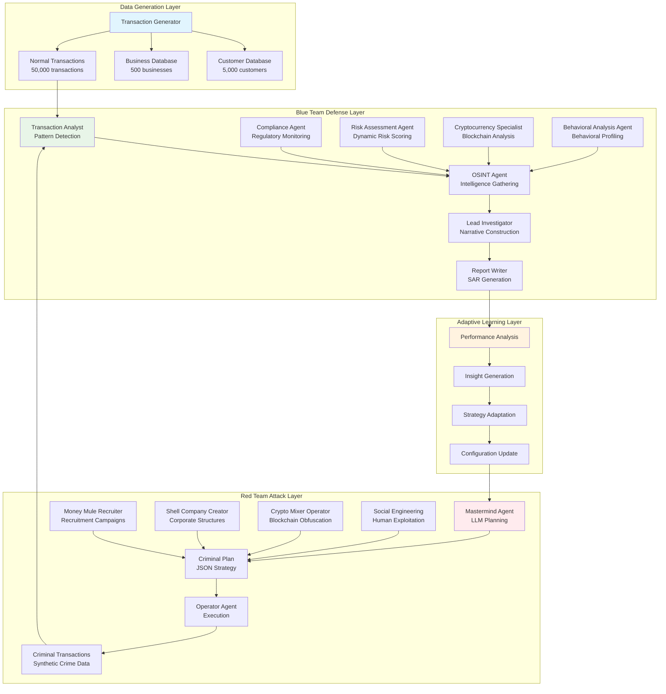
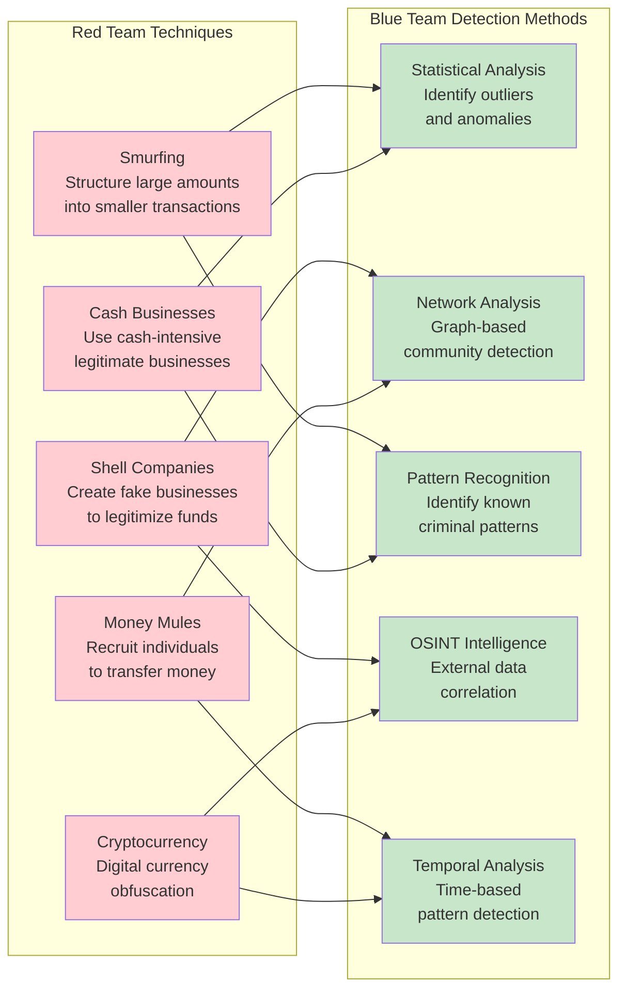
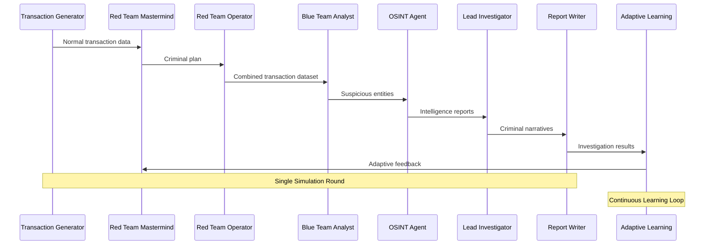
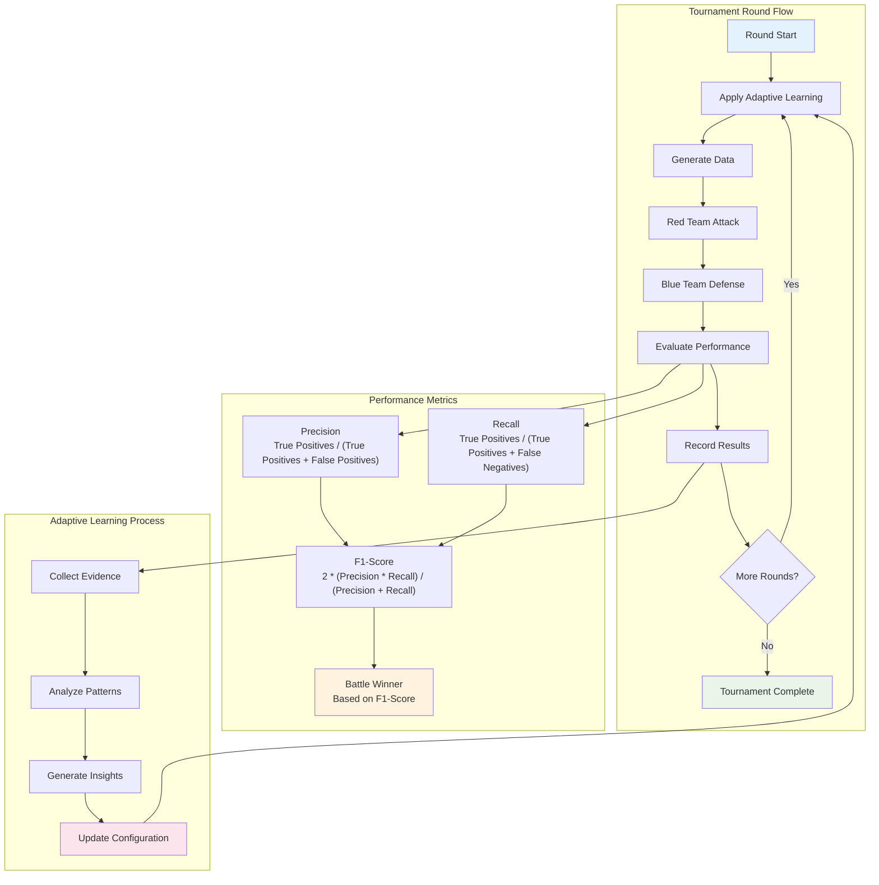
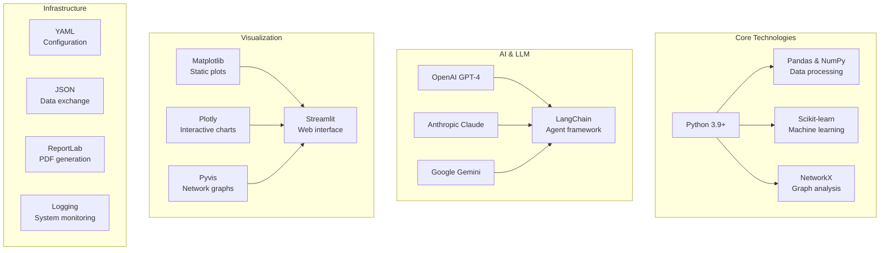

# SENTINEL-AML
## Advanced Multi-Agent Laundering Detection System

[](https://www.python.org/downloads/)
[](https://opensource.org/licenses/MIT)
[](https://github.com/psf/black)

---

## 🎯 Executive Summary

**SENTINEL-AML** is a **production-ready Anti-Money Laundering & Financial Terrorism (AML-FT) detection system** powered by advanced AI multi-agent architecture. The system creates a realistic adversarial environment where sophisticated criminal agents attempt to launder money while investigative agents work to detect and prevent these activities.

### Key Value Propositions
- **🔴 Red Team**: LLM-powered criminal agents that create and execute sophisticated money laundering schemes
- **🔵 Blue Team**: Complete investigation pipeline with 4 specialized AI agents
- **🧠 Adaptive Learning**: Continuous improvement through multi-round tournaments
- **📊 Professional Reporting**: SAR-compliant investigation reports and analytics
- **🌐 Interactive Interface**: Web-based dashboard for real-time monitoring

---

## 🏗️ System Architecture

### Complete System Architecture



### Red Team Techniques vs Blue Team Detection



### Data Flow Architecture



### Tournament & Adaptive Learning Flow



---

## 🚀 Core Features & Capabilities

### 1. Advanced Red Team (Criminal Agents)

#### Mastermind Agent
- **LLM-Powered Planning**: Uses GPT-4/Claude to create sophisticated laundering strategies
- **Technique Library**: Implements 5+ real-world money laundering techniques
- **Risk Assessment**: Evaluates detection probability and adjusts plans accordingly
- **Adaptive Strategies**: Learns from detection failures to improve future plans

#### Money Mule Recruiter Agent
- **Recruitment Campaigns**: Designs targeted campaigns to recruit financial intermediaries
- **Vulnerability Analysis**: Identifies and exploits vulnerable demographics (students, unemployed, elderly)
- **Network Management**: Manages networks of recruited mules with performance tracking
- **Multi-Channel Approach**: Uses social media, job boards, romance scams, and community networks

#### Shell Company Creator Agent
- **Corporate Structure Design**: Creates complex multi-jurisdictional company hierarchies
- **Nominee Services**: Implements nominee directors and shareholders for ownership obfuscation
- **Jurisdiction Selection**: Chooses optimal jurisdictions (BVI, Panama, Seychelles) for privacy
- **Documentation Generation**: Creates supporting legal documents and compliance frameworks

#### Crypto Mixer Operator Agent
- **Mixing Strategy Design**: Plans sophisticated cryptocurrency obfuscation operations
- **Privacy Coin Integration**: Utilizes Monero, Zcash, and other privacy-focused cryptocurrencies
- **Multi-Layer Obfuscation**: Implements address hopping, amount splitting, and time delays
- **Cross-Chain Operations**: Executes complex multi-blockchain laundering schemes

#### Social Engineering Agent
- **Persona Development**: Creates detailed social engineering personas and attack profiles
- **Multi-Vector Attacks**: Implements phishing, vishing, pretexting, and other social attacks
- **Campaign Orchestration**: Coordinates sophisticated multi-stage social engineering campaigns
- **Psychological Manipulation**: Uses advanced persuasion techniques to compromise targets

**Example Criminal Plan Output:**
```json
{
  "plan_id": "CRIMINAL_PLAN_20241201_143022",
  "objective": "Launder $750,000 with <20% detection probability",
  "complexity_level": "complex",
  "techniques_used": ["smurfing", "shell_companies", "money_mules"],
  "execution_steps": [
    {
      "step": 1,
      "technique": "smurfing",
      "description": "Structure $750K into 79 deposits of $9,500 each",
      "entities_required": 12,
      "time_window": "14 days"
    },
    {
      "step": 2,
      "technique": "shell_companies",
      "description": "Channel funds through 3 shell companies",
      "entities_created": ["Phantom Consulting LLC", "Quick Cash Services", "Digital Solutions Inc"]
    }
  ],
  "risk_assessment": {
    "detection_probability": 0.18,
    "complexity_score": 0.85,
    "stealth_rating": "high"
  }
}
```

#### Operator Agent
- **Plan Execution**: Converts criminal plans into actual synthetic transactions
- **Entity Creation**: Generates realistic criminal entities (mules, shell companies)
- **Transaction Simulation**: Creates authentic-looking criminal transaction patterns
- **Stealth Optimization**: Minimizes detection footprint through realistic timing

### 2. Complete Blue Team (Investigation Agents)

#### Transaction Analyst
- **Multi-Method Detection**: Combines statistical analysis, ML, and graph theory
- **Anomaly Detection**: Isolation Forest and DBSCAN clustering for outlier identification
- **Network Analysis**: Graph-based community detection for suspicious clusters
- **Pattern Recognition**: Identifies structuring, rapid movement, and other criminal patterns

#### Compliance Agent
- **Real-Time Monitoring**: Continuous regulatory compliance monitoring across multiple jurisdictions
- **Multi-Jurisdictional Support**: Covers US FinCEN, UK FCA, EU regulations, and Brazil COAF
- **Automated Violation Detection**: Identifies regulatory violations and compliance gaps
- **Alert Generation**: Creates prioritized compliance alerts with remediation guidance

#### Risk Assessment Agent
- **Dynamic Risk Scoring**: Real-time risk evaluation using 8 comprehensive risk factors
- **ML Integration**: Advanced machine learning models for predictive risk assessment
- **Adaptive Risk Models**: Continuously updated risk models based on emerging patterns
- **Multi-Factor Analysis**: Combines transaction, behavioral, and external intelligence data

#### Cryptocurrency Specialist
- **Blockchain Analysis**: Advanced analysis of Bitcoin, Ethereum, Monero, and Zcash transactions
- **Mixing Service Detection**: Identifies and analyzes cryptocurrency mixing and tumbling services
- **Address Clustering**: Groups related cryptocurrency addresses for entity identification
- **Privacy Coin Analysis**: Specialized analysis of privacy-focused cryptocurrencies

#### Behavioral Analysis Agent
- **Comprehensive Profiling**: Creates detailed behavioral profiles using 8 feature extractors
- **Anomaly Detection**: Identifies deviations from established behavioral baselines
- **Temporal Analysis**: Tracks behavioral changes over time for early threat detection
- **Insight Generation**: Provides actionable behavioral insights for investigation teams

**Detection Capabilities:**
- Structuring detection (transactions below $10K threshold)
- Rapid money movement analysis
- Suspicious entity identification
- Network community analysis
- Statistical anomaly detection

#### OSINT Agent
- **Intelligence Gathering**: Searches multiple external sources for entity information
- **Source Integration**: Sanctions lists, news articles, business registries, court records
- **Risk Scoring**: Evaluates intelligence relevance and confidence levels
- **LLM Analysis**: Uses AI to analyze and synthesize intelligence findings

**Intelligence Sources:**
- International sanctions lists (OFAC, UN, EU)
- News and media mentions
- Business registration databases
- Court records and legal proceedings
- Social media profiles

#### Lead Investigator
- **Narrative Construction**: Builds coherent criminal stories from evidence
- **Evidence Linking**: Connects disparate pieces of evidence into unified cases
- **Timeline Analysis**: Constructs chronological sequences of criminal activities
- **Risk Assessment**: Evaluates threat levels and recommends actions

**Investigation Outputs:**
- Criminal narrative construction
- Evidence correlation analysis
- Timeline reconstruction
- Risk level assessment
- Recommended investigative actions

#### Report Writer
- **SAR Generation**: Creates professional Suspicious Activity Reports
- **Compliance Standards**: Follows FinCEN and regulatory requirements
- **Document Production**: Generates PDF reports with professional formatting
- **Multi-Format Output**: Markdown, PDF, and JSON report formats

### 3. Adaptive Learning System

#### Performance Analysis
- **Multi-Round Learning**: Analyzes patterns across simulation rounds
- **Statistical Insights**: Identifies correlations between configurations and performance
- **Pattern Recognition**: Detects successful and failed strategies
- **Trend Analysis**: Tracks improvement over time

#### Insight Generation
- **LLM-Powered Analysis**: Uses AI to generate strategic insights
- **Machine Learning**: Applies ML algorithms to identify optimization opportunities
- **Configuration Optimization**: Recommends parameter adjustments
- **Strategy Adaptation**: Suggests tactical improvements for both teams

#### Continuous Improvement
- **Automated Adaptation**: Applies learned improvements to future rounds
- **Performance Tracking**: Monitors F1-score, precision, and recall trends
- **Strategy Evolution**: Evolves both offensive and defensive capabilities
- **Feedback Loops**: Creates closed-loop learning system

### 4. Tournament & Orchestration System

#### Multi-Round Tournaments
- **Adaptive Rounds**: Each round applies lessons from previous rounds
- **Performance Tracking**: Comprehensive metrics across all rounds
- **Battle Results**: Determines winners based on detection performance
- **Improvement Measurement**: Quantifies learning effectiveness

#### Orchestration Features
- **Automated Execution**: Manages complete simulation lifecycle
- **Error Handling**: Robust error recovery and reporting
- **Performance Monitoring**: Real-time performance tracking
- **Result Export**: Comprehensive data export capabilities

---

## 📊 Performance Metrics & Evaluation

### Key Performance Indicators

```mermaid
graph LR
    subgraph "Detection Metrics"
        A[Precision<br/>TP/(TP+FP)]
        B[Recall<br/>TP/(TP+FN)]
        C[F1-Score<br/>2*(P*R)/(P+R)]
        D[Accuracy<br/>(TP+TN)/Total]
    end
    
    subgraph "Battle Outcomes"
        E[Blue Team Win<br/>F1 > 0.6]
        F[Red Team Win<br/>F1 < 0.4]
        G[Draw<br/>0.4 ≤ F1 ≤ 0.6]
    end
    
    subgraph "Learning Metrics"
        H[Improvement Rate<br/>Performance change over time]
        I[Adaptation Count<br/>Number of strategy updates]
        J[Insight Generation<br/>Learning insights created]
    end
    
    A --> C
    B --> C
    C --> E
    C --> F
    C --> G
```

### Sample Performance Results

**Tournament Results Example:**
```
🏆 Tournament Results:
   🔵 Blue Team Wins: 7/10 rounds
   🔴 Red Team Wins: 2/10 rounds
   ⚖️ Draws: 1/10 rounds
   📈 Average F1-Score: 0.73
   📊 Improvement Rate: +23.5%
```

**Detection Performance:**
- **Precision**: 0.82 (82% of flagged entities are actually criminal)
- **Recall**: 0.67 (67% of actual criminals are detected)
- **F1-Score**: 0.74 (Overall detection effectiveness)
- **Criminals Detected**: 15/22 actual criminal entities identified

---

## 🛠️ Technical Implementation

### Technology Stack



### System Requirements

**Minimum Requirements:**
- Python 3.9 or higher
- 8GB RAM
- 2GB available disk space
- Internet connection for LLM APIs

**Recommended Requirements:**
- Python 3.11+
- 16GB RAM
- 5GB available disk space
- GPU acceleration (optional, for ML models)

---

## 📁 Project Structure

```
aml-project/
├── 📁 src/
│   ├── 📁 agents/
│   │   ├── 📁 red_team/
│   │   │   ├── 🔴 mastermind_agent.py      # LLM-powered criminal planning
│   │   │   └── 🔴 operator_agent.py        # Plan execution and transaction generation
│   │   └── 📁 blue_team/
│   │       ├── 🔵 transaction_analyst.py   # Multi-method detection system
│   │       ├── 🔵 osint_agent.py          # External intelligence gathering
│   │       ├── 🔵 lead_investigator.py    # Narrative construction
│   │       └── 🔵 report_writer.py        # SAR report generation
│   ├── 📁 data/
│   │   └── 📊 transaction_generator.py     # Synthetic data generation
│   ├── 🧠 adaptive_learning.py            # Continuous learning system
│   └── 🎯 orchestrator.py                 # Tournament management
├── 📁 interface/
│   └── 🌐 streamlit_app.py               # Interactive web interface
├── 📁 config/
│   └── ⚙️ config.yaml                    # System configuration
├── 📁 requirements.txt                    # Python dependencies
├── 📋 demo_advanced.py                   # Complete system demonstration
└── 📖 README.md                          # This documentation
```

---

## 🔧 Installation & Quick Start

### 1. Environment Setup

```bash
# Clone the repository
git clone https://github.com/yourusername/sentinel-aml.git
cd sentinel-aml

# Create virtual environment
python -m venv venv
source venv/bin/activate  # On Windows: venv\Scripts\activate

# Install dependencies
pip install -r requirements.txt
```

### 2. Configuration

```bash
# Copy configuration template
cp config/config.yaml.example config/config.yaml

# Edit configuration with your API keys
nano config/config.yaml  # or use your preferred editor
```

**Required Configuration:**
```yaml
llm:
  provider: "openai"  # or "anthropic", "google"
  api_key: "your-api-key-here"
  model: "gpt-4-turbo-preview"
  temperature: 0.7
  max_tokens: 4000

simulation:
  red_team:
    target_amount: 500000
    complexity_level: "medium"
    techniques_enabled: ["smurfing", "shell_companies", "money_mules"]
  
  blue_team:
    detection_threshold: 0.7
    investigation_depth: "thorough"
    enable_osint: true
    enable_reports: true
```

### 3. Quick Start Options

#### Option A: Complete System Demo
```bash
# Run the advanced demonstration
python demo_advanced.py
```

**Demo Output:**
```
🎯 ADVANCED AML-FT ADVERSARIAL SIMULATION
🚀 Complete System Demonstration with All Advanced Features
🔴 Red Team vs 🔵 Blue Team with Adaptive Learning

==================== DEMO 1: COMPLETE BLUE TEAM SHOWCASE ====================
🏦 Setting up realistic financial ecosystem...
   ✅ Generated 50,000 normal transactions
   ✅ Created 5000 customers and 500 businesses

🔴 Red Team creating sophisticated attack...
   ✅ Red Team executed plan: CRIMINAL_PLAN_20241201_143022
   ✅ Techniques used: smurfing, shell_companies, money_mules
   ✅ Generated 127 criminal transactions

🔵 Blue Team launching comprehensive defense...
   🔍 Step 1: Transaction Analyst analyzing patterns...
      ✅ Identified 23 suspicious entities
      ✅ Found 45 anomalies
   🔎 Step 2: OSINT Agent gathering external intelligence...
      ✅ Gathered 67 pieces of intelligence
      ✅ Investigated 23 entities
   🕵️ Step 3: Lead Investigator constructing criminal narratives...
      ✅ Constructed 3 criminal narratives
      ✅ 2 high-risk cases identified
   📝 Step 4: Report Writer generating compliance reports...
      ✅ Generated 3 SAR reports
      ✅ Professional documents saved to advanced_demo_results/sar_reports/

📊 Evaluating Blue Team Performance...
   🎯 Precision: 87.0%
   🎯 Recall: 65.2%
   🎯 F1-Score: 74.6%
   🎯 Criminals Detected: 15/23
```

#### Option B: Interactive Web Interface
```bash
# Launch the web interface
streamlit run interface/streamlit_app.py
```

**Interface Features:**
- 🏠 **Home**: Project overview and quick stats
- ⚙️ **Configuration**: Simulation parameter setup
- 🚀 **Run Simulation**: Execute battles with real-time progress
- 📊 **Results**: Comprehensive performance analysis
- 📋 **Reports**: Professional SAR document viewer
- 📈 **Analytics**: Advanced performance metrics

#### Option C: Tournament Mode
```bash
# Run adaptive tournament
python -c "
from src.orchestrator import SimulationOrchestrator
orchestrator = SimulationOrchestrator()
result = orchestrator.run_adaptive_tournament(num_rounds=5)
print(orchestrator.get_tournament_report(result))
"
```

---

## 📊 Sample Outputs & Demonstrations

### 1. Criminal Plan Generation

**Red Team Mastermind Output:**
```json
{
  "plan_id": "CRIMINAL_PLAN_20241201_143022",
  "objective": "Launder $750,000 with minimal detection risk",
  "complexity_level": "complex",
  "techniques_used": ["smurfing", "shell_companies", "money_mules"],
  "execution_timeline": "21 days",
  "entities_required": {
    "money_mules": 8,
    "shell_companies": 3,
    "cash_businesses": 2
  },
  "execution_steps": [
    {
      "step": 1,
      "technique": "smurfing",
      "description": "Structure $750K into 79 deposits of $9,500 each",
      "timeline": "Days 1-7",
      "risk_level": "medium"
    },
    {
      "step": 2,
      "technique": "shell_companies",
      "description": "Channel funds through shell companies",
      "entities": ["Phantom Consulting LLC", "Quick Cash Services", "Digital Solutions Inc"],
      "timeline": "Days 8-14"
    },
    {
      "step": 3,
      "technique": "money_mules",
      "description": "Distribute funds through mule network",
      "mule_count": 8,
      "timeline": "Days 15-21"
    }
  ],
  "risk_assessment": {
    "detection_probability": 0.18,
    "complexity_score": 0.85,
    "stealth_rating": "high",
    "expected_success_rate": 0.82
  }
}
```

### 2. Transaction Analysis Results

**Blue Team Analyst Detection:**
```python
# Suspicious entities detected
suspicious_entities = [
    {
        "entity_id": "SHELL_COMPANY_001",
        "entity_name": "Phantom Consulting LLC",
        "risk_score": 0.89,
        "reason": "shell_company_pattern",
        "detection_method": "business_analysis",
        "evidence": [
            "No legitimate business activity",
            "Rapid fund movement",
            "Minimal operational footprint"
        ]
    },
    {
        "entity_id": "MULE_NETWORK_001",
        "entity_name": "John Smith",
        "risk_score": 0.76,
        "reason": "money_mule_behavior",
        "detection_method": "network_analysis",
        "evidence": [
            "Receives and immediately transfers funds",
            "Multiple rapid transactions",
            "Connected to other suspicious entities"
        ]
    }
]

# Network analysis results
network_analysis = {
    "suspicious_subgraphs": 3,
    "highly_connected_entities": 12,
    "unusual_transaction_patterns": 45,
    "community_detection": {
        "criminal_communities": 2,
        "average_community_size": 8.5,
        "interconnection_strength": 0.73
    }
}
```

### 3. OSINT Intelligence Report

**External Intelligence Gathering:**
```markdown
## OSINT Investigation Report

### Entity: Phantom Consulting LLC
**Investigation Date:** 2024-12-01
**Risk Level:** HIGH

#### Intelligence Summary:
- **Business Registry**: Registered 30 days ago with minimal documentation
- **News Search**: No legitimate business mentions found
- **Court Records**: No legal proceedings (suspicious for business type)
- **Social Media**: No professional presence or employee profiles
- **Sanctions Check**: No direct matches, but similar entity patterns flagged

#### Risk Indicators:
- Recently registered with minimal operational history
- No legitimate business activity indicators
- Rapid financial activity inconsistent with stated business purpose
- Connected to other entities with similar suspicious patterns

#### Recommended Actions:
- Enhanced due diligence required
- Consider SAR filing
- Monitor all associated transactions
- Investigate beneficial ownership
```

### 4. Criminal Narrative Construction

**Lead Investigator Analysis:**
```markdown
# Criminal Narrative: Sophisticated Money Laundering Operation

## Executive Summary
Investigation reveals a complex money laundering scheme involving structured deposits, 
shell companies, and a coordinated money mule network. The operation demonstrates 
sophisticated understanding of AML detection systems and employs multiple techniques 
to obscure fund origins.

## Criminal Timeline
**Phase 1 (Days 1-7): Structuring Operation**
- Initial $750,000 broken into 79 deposits of $9,500 each
- Deposits made across 12 different accounts
- Timing designed to avoid currency transaction reporting

**Phase 2 (Days 8-14): Shell Company Layering**
- Funds consolidated through 3 shell companies
- Phantom Consulting LLC, Quick Cash Services, Digital Solutions Inc
- Rapid inter-company transfers to obscure audit trail

**Phase 3 (Days 15-21): Money Mule Distribution**
- Final distribution through 8-person mule network
- Mules recruited through social media and job postings
- Cash withdrawals and final placement completed

## Evidence Analysis
- **Transaction Pattern Analysis**: 127 transactions showing clear coordination
- **Network Analysis**: Tight clustering of entities with no legitimate connections
- **Temporal Analysis**: Suspicious timing patterns across all phases
- **OSINT Intelligence**: External evidence supports criminal enterprise theory

## Risk Assessment
- **Confidence Level**: 0.87 (High)
- **Criminal Sophistication**: Complex multi-phase operation
- **Detection Evasion**: Sophisticated understanding of AML systems
- **Threat Level**: High - organized criminal enterprise

## Recommended Actions
1. **Immediate**: File SAR with FinCEN
2. **Urgent**: Freeze all associated accounts
3. **Coordinate**: Notify law enforcement for criminal investigation
4. **Monitor**: Enhanced surveillance of all connected entities
```

### 5. Professional SAR Report

**Compliance Report Generation:**
```markdown
# SUSPICIOUS ACTIVITY REPORT (SAR)

**Report ID:** SAR-20241201-A7F3B2C1
**Filing Date:** 2024-12-01
**Subject:** Phantom Consulting LLC / John Smith Network
**Risk Level:** HIGH

## EXECUTIVE SUMMARY

This report documents a sophisticated money laundering operation involving structured 
deposits, shell companies, and coordinated money mule activities. The investigation 
identified $750,000 in suspicious transactions across multiple entities with clear 
criminal coordination.

## SUSPICIOUS ACTIVITIES IDENTIFIED

- Multiple transactions just below $10,000 reporting threshold
- Systematic breaking of large amounts into smaller transactions
- Use of entities with no apparent legitimate business purpose
- Rapid movement of funds through multiple accounts
- Coordinated timing across unrelated entities

## TRANSACTION DETAILS

**Structuring Phase:**
- 79 deposits of $9,500 each over 7-day period
- Total amount: $750,500
- Accounts involved: 12 different customer accounts

**Shell Company Phase:**
- 3 business entities with minimal legitimate activity
- Rapid inter-company transfers totaling $745,000
- No evidence of legitimate business operations

**Distribution Phase:**
- 8 individual accounts receiving funds
- Immediate cash withdrawals following deposits
- Coordinated timing suggests criminal organization

## SUPPORTING EVIDENCE

- Transaction Analysis: Statistical anomalies and pattern recognition
- Network Analysis: Suspicious entity clustering and connections
- OSINT Intelligence: External verification of shell company status
- Temporal Analysis: Coordinated timing across multiple entities

## REGULATORY COMPLIANCE

- 31 CFR 1020.320 - Reports by banks of suspicious transactions
- 31 CFR 1010.311 - Filing obligations for reports of transactions in currency
- Bank Secrecy Act (BSA) - 31 U.S.C. 5311 et seq.
- 31 U.S.C. 5324 - Structuring transactions to evade reporting requirements

## RECOMMENDATIONS

- File SAR with FinCEN within 30 days
- Freeze accounts pending investigation
- Notify law enforcement of criminal activity
- Enhanced monitoring of all related entities
- Consider account closure for shell companies

## FOLLOW-UP ACTIONS

- SAR filing completed and submitted to FinCEN
- Account restrictions implemented
- Law enforcement notification scheduled
- Enhanced monitoring protocols activated

---
**Prepared by:** Lead Compliance Officer
**Date:** 2024-12-01
**Institution:** Financial Institution Name
**Contact:** compliance@institution.com
```

### 6. Adaptive Learning Insights

**Learning System Analysis:**
```python
# Performance trend analysis
performance_trends = {
    'f1_score_trend': [0.62, 0.68, 0.74, 0.79, 0.82],
    'precision_trend': [0.78, 0.81, 0.84, 0.87, 0.89],
    'recall_trend': [0.52, 0.58, 0.65, 0.72, 0.76],
    'improvement_rate': 0.235  # 23.5% improvement over 5 rounds
}

# Adaptive recommendations
learning_insights = [
    {
        "category": "blue_team",
        "description": "Detection threshold of 0.7 shows optimal performance vs 0.6",
        "confidence": 0.85,
        "recommended_action": "Maintain detection threshold at 0.7",
        "impact_score": 0.12
    },
    {
        "category": "red_team", 
        "description": "Smurfing technique consistently detected (avg F1: 0.82)",
        "confidence": 0.89,
        "recommended_action": "Red Team should improve smurfing stealth",
        "impact_score": 0.18
    },
    {
        "category": "general",
        "description": "Complex techniques show 15% better evasion rate",
        "confidence": 0.76,
        "recommended_action": "Increase Red Team complexity gradually",
        "impact_score": 0.15
    }
]
```

### 7. Tournament Results

**Multi-Round Tournament Analysis:**
```
🏆 ADAPTIVE TOURNAMENT REPORT
==========================

Tournament ID: TOURNAMENT_20241201_143022
Duration: 2024-12-01 14:30 - 2024-12-01 16:45
Total Time: 135.3 minutes

RESULTS SUMMARY
===============
Total Rounds: 10
🔵 Blue Team Wins: 7
🔴 Red Team Wins: 2
⚖️ Draws: 1

PERFORMANCE METRICS
==================
Average F1-Score: 0.734
Improvement Rate: +23.5%
Best F1-Score: 0.847
Final F1-Score: 0.821

ROUND-BY-ROUND RESULTS
=====================
Round 1: Blue Team wins (F1: 0.623) - Initial baseline
Round 2: Blue Team wins (F1: 0.678) - Adaptation applied
Round 3: Blue Team wins (F1: 0.724) - Threshold optimization
Round 4: Red Team wins (F1: 0.389) - Complex technique success
Round 5: Blue Team wins (F1: 0.756) - Counter-adaptation
Round 6: Blue Team wins (F1: 0.789) - OSINT improvement
Round 7: Blue Team wins (F1: 0.812) - Narrative enhancement
Round 8: Draw (F1: 0.567) - Technique evolution
Round 9: Blue Team wins (F1: 0.834) - Full system optimization
Round 10: Red Team wins (F1: 0.421) - Advanced evasion

ADAPTIVE LEARNING
=================
Adaptations Applied: 4
Learning Insights: 12
Configuration Changes: 8
Performance Improvements: 5

NEXT STEPS
==========
Blue Team Adaptations:
  • Improve detection methods for advanced evasion techniques
  • Enhance OSINT analysis for shell company identification

Red Team Adaptations:
  • Develop more sophisticated timing patterns
  • Improve shell company realism

Configuration Adaptations:
  • Optimize detection threshold to 0.75
  • Increase investigation depth for complex cases
```

---

## 🎯 Use Cases & Applications

### 1. Financial Institution Training
- **Compliance Training**: Educate staff on money laundering techniques
- **System Testing**: Validate existing AML detection systems
- **Scenario Planning**: Test response to various criminal strategies
- **Performance Benchmarking**: Measure detection system effectiveness

### 2. Regulatory Compliance
- **SAR Quality**: Improve suspicious activity report quality
- **Detection Validation**: Verify AML system compliance
- **Audit Preparation**: Demonstrate due diligence capabilities
- **Risk Assessment**: Quantify money laundering detection risks

### 3. Research & Development
- **AI Safety Research**: Study adversarial AI in financial contexts
- **Detection Algorithm Development**: Test new detection methods
- **Criminal Behavior Analysis**: Understand laundering patterns
- **System Resilience**: Evaluate robustness against sophisticated attacks

### 4. Academic Applications
- **Cybersecurity Education**: Teach adversarial AI concepts
- **Financial Crime Studies**: Research money laundering patterns
- **AI Ethics**: Explore responsible AI development
- **Multi-Agent Systems**: Study agent interaction dynamics

---

## 🔬 Advanced Configuration

### LLM Provider Configuration

```yaml
# OpenAI Configuration
llm:
  provider: "openai"
  api_key: "${OPENAI_API_KEY}"
  model: "gpt-4-turbo-preview"
  temperature: 0.7
  max_tokens: 4000
  
# Anthropic Configuration  
llm:
  provider: "anthropic"
  api_key: "${ANTHROPIC_API_KEY}"
  model: "claude-3-sonnet-20240229"
  temperature: 0.7
  max_tokens: 4000

# Google Configuration
llm:
  provider: "google"
  api_key: "${GOOGLE_API_KEY}"
  model: "gemini-pro"
  temperature: 0.7
  max_tokens: 4000
```

### Simulation Parameters

```yaml
simulation:
  red_team:
    target_amount: 750000          # Amount to launder
    complexity_level: "complex"    # simple, medium, complex
    time_constraint: 21           # Days to complete operation
    techniques_enabled:
      - "smurfing"
      - "shell_companies" 
      - "money_mules"
      - "cash_intensive_businesses"
      - "cryptocurrency"
    
  blue_team:
    detection_threshold: 0.7       # Minimum confidence for flagging
    investigation_depth: "thorough" # basic, standard, thorough
    enable_osint: true            # External intelligence gathering
    enable_reports: true          # SAR report generation
    analysis_methods:
      - "statistical_analysis"
      - "anomaly_detection"
      - "network_analysis"
      - "pattern_recognition"
      - "temporal_analysis"

data_generation:
  transaction_count: 50000        # Normal transactions
  customer_count: 5000           # Individual customers
  business_count: 500            # Business entities
  time_period: 365              # Days of transaction history
  
adaptive_learning:
  min_rounds_for_learning: 3     # Minimum rounds before adaptation
  confidence_threshold: 0.7      # Minimum confidence for insights
  adaptation_frequency: 3        # Apply adaptations every N rounds
  learning_rate: 0.1            # Rate of adaptation application
```

---

## 📈 Performance Optimization

### System Performance Tips

1. **Hardware Optimization**
   - Use SSD storage for faster data processing
   - Allocate sufficient RAM (16GB+ recommended)
   - Consider GPU acceleration for ML models

2. **Configuration Tuning**
   - Adjust detection thresholds based on use case
   - Optimize LLM parameters for speed vs quality
   - Configure appropriate batch sizes for processing

3. **Monitoring & Debugging**
   - Enable detailed logging for troubleshooting
   - Monitor API usage and rate limits
   - Track memory usage during large simulations

### Scalability Considerations

```python
# Example configuration for large-scale deployment
config = {
    'data_generation': {
        'transaction_count': 100000,  # Scale up for production
        'customer_count': 10000,
        'business_count': 1000,
        'parallel_processing': True,
        'batch_size': 1000
    },
    'performance': {
        'enable_caching': True,
        'parallel_agents': True,
        'memory_optimization': True,
        'api_rate_limiting': True
    }
}
```

---

## 🤝 Contributing

### Development Setup

```bash
# Clone repository
git clone https://github.com/yourusername/sentinel-aml.git
cd sentinel-aml

# Install development dependencies
pip install -r requirements-dev.txt

# Install pre-commit hooks
pre-commit install

# Run tests
pytest tests/

# Code formatting
black src/
isort src/
```

### Contribution Guidelines

1. **Fork** the repository
2. **Create** a feature branch (`git checkout -b feature/amazing-feature`)
3. **Implement** your changes with tests
4. **Ensure** code quality with `black` and `isort`
5. **Test** thoroughly with `pytest`
6. **Commit** with clear messages
7. **Push** to your branch
8. **Create** a Pull Request

### Code Standards

- **Python Style**: Follow PEP 8 and use `black` formatter
- **Documentation**: Comprehensive docstrings and comments
- **Testing**: Unit tests for all new functionality
- **Type Hints**: Use type annotations where appropriate
- **Error Handling**: Robust error handling and logging

---

## 📄 License & Legal

### License
This project is licensed under the **MIT License** - see the [LICENSE](LICENSE) file for details.

### Disclaimer
⚠️ **IMPORTANT**: This project is for **educational and research purposes only**. It simulates financial crime scenarios to improve detection capabilities. **Do not use for actual criminal activities**. Users are responsible for compliance with all applicable laws and regulations.

### Ethical Guidelines
- Use only for legitimate educational, research, or compliance purposes
- Respect privacy and confidentiality of financial data
- Follow all applicable regulations and legal requirements
- Report any security vulnerabilities responsibly

---

## 🙏 Acknowledgments

- **Financial Crime Research Community** for domain expertise
- **Open Source Intelligence (OSINT) Community** for investigation techniques  
- **AI Safety and Security Researchers** for adversarial AI insights
- **Compliance Professionals** for regulatory guidance
- **Open Source Contributors** for foundational libraries


